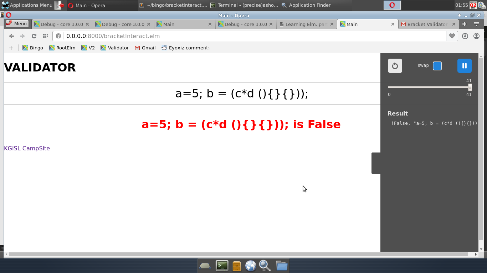
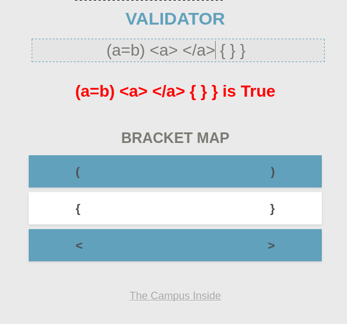
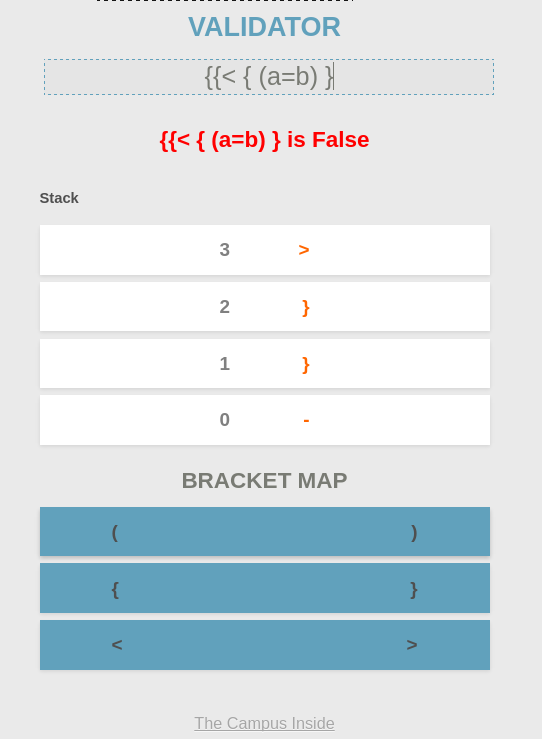
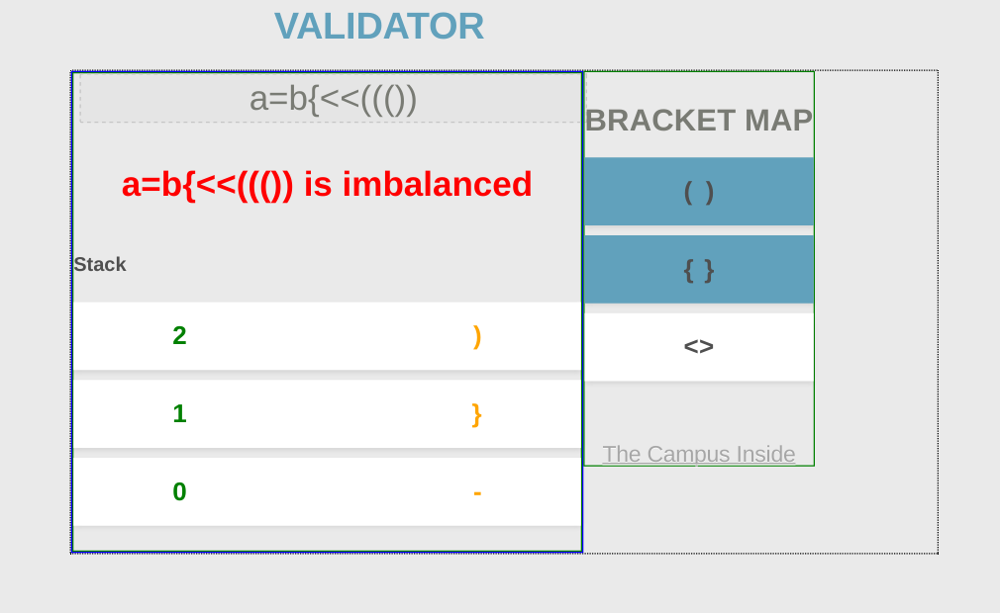
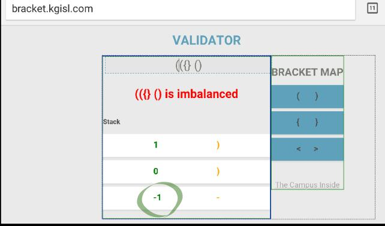

# elmo-bracket

Implementation of Interactive visual bracket validator.  
For ideas on how to use and extend this project, see [this](challenge.md)

## Version 0 
Simple validator 

## Version 1.0 
Simple validator with bracket pairs that can be dynamically disabled, enabled

## Version 2.0 
Stack is now visible, with more meaningful error messages enabled. 

### Version 2.1 
CSS-enhanced Validator; with stack and bracket placed side-by-side

### Version 2.2
Now stack exhibits an Array-based stack (showing `-1`)

